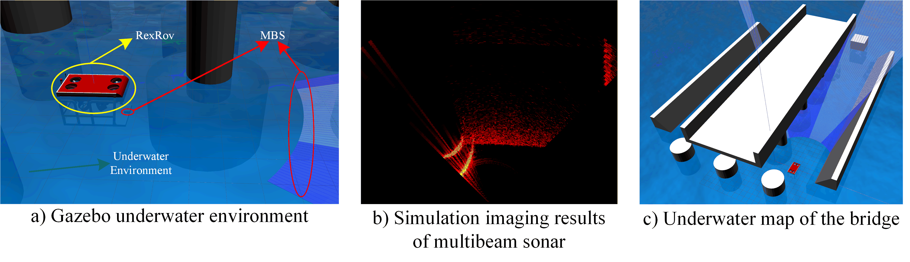

1.IMBS: 
    
    Positioning and mapping of underwater vehicles using IMU and multibeam sonar

2.Installation instructions：

    environment：C++17
                 Ubuntu20.04
                 ROS Noetic
                 Opencv
                 PCL
                 CERES
                 CV_BRIDGE
    
    install：
            1. reference resources https://field-robotics-lab.github.io/dave.doc/ Install DAVE emulator
            2. NOTE: If you want to use multi beam sonar, please be sure to install NVIDIA cuda and related drivers
            3. After installation is completed, there is a workspace uuv_ws in the directory
            4. cd uuv_ws/src
            5. git clone this project's package
            6. roslaunch uuv_rexrov_sonar sonar_slam.launch
               You can see a gazebo underwater environment, including rexrov, as shown in the following figure
               \
               
            7. Place the mouse on the terminal and use WASD and QEZX to control the movement of the ROV
            8. rosrun uuv_rexrov_sonar ros_noetic_running_node Start Frontend pose estimation
               You can use RVIZ to view related topics, where you can see trajectories and point cloud maps
            9. rosrun uuv_rexrov_sonar ros_noetic_backend_node
               Then perform backend optimization

3.problem：

    If you have any questions, you can contact us through the following email address
    Email: 821785315@foxmail.com
